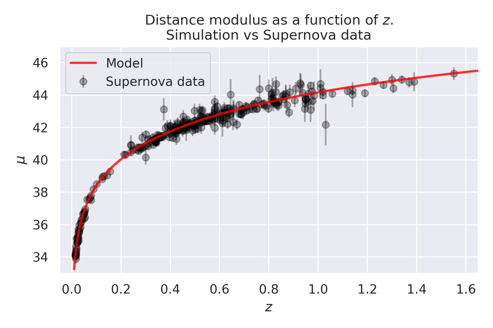

**[See full project report and explanation.](https://github.com/GabrielMissael/cosmologia_p1/blob/master/project_report.pdf) 🔥**

    

# Cosmology: Project 1.
Prof. Alma Xóchitl González

By: **Gabriel Missael Barco** - 15/03/2022

## Abstract. 🧠

This project simulates the evolution of a homogeneous, isotropic, and spatially-flat universe using the standard co  smological model Λ-CDM and the cosmological parameters given by the Planck experiment. We use the Runge-Kutta method of order 4 to solve for the scale factor _a_ and at the same time obtain the evolution of the different matter-energy species densities. With that information, we analyze the development of those variables as a function of redshift, time, and scale factors (in the case of densities). Finally, using the same information, we obtain different distance measures for such a universe and compare the predicted distance modulus with observational supernova data from _https://supernova.lbl.gov/Union/figures/SCPUnion_mu_vs_z.txt_.

## Conclusions. 🤗

In this project, we simulated the evolution of a homogeneous, isotropic, and spatially-flat universe using the standard cosmological model Λ-CDM and the cosmological parameters given by the Planck experiment. We obtained different essential properties, such as the evolution of the energy-matter species (radiation, matter, and dark energy), the three distance measures (proper, luminosity, and angular-diameter distances), and the expansion factor.

The plots obtained in this project successfully reproduce the analogous plots presented in class, as proof of a correct simulation of the model. More importantly, the model successfully describes one observational variable given by supernova data as standard candles: the distance modulus.
We conclude that this Universe model is successfully numerically solved using the Runge-Kutta method of order four and a naive approximation for integration (for the proper distance). Furthermore, this model successfully describes the observational data used in this project.

## Gallery. 🌎

    

    

    

    

